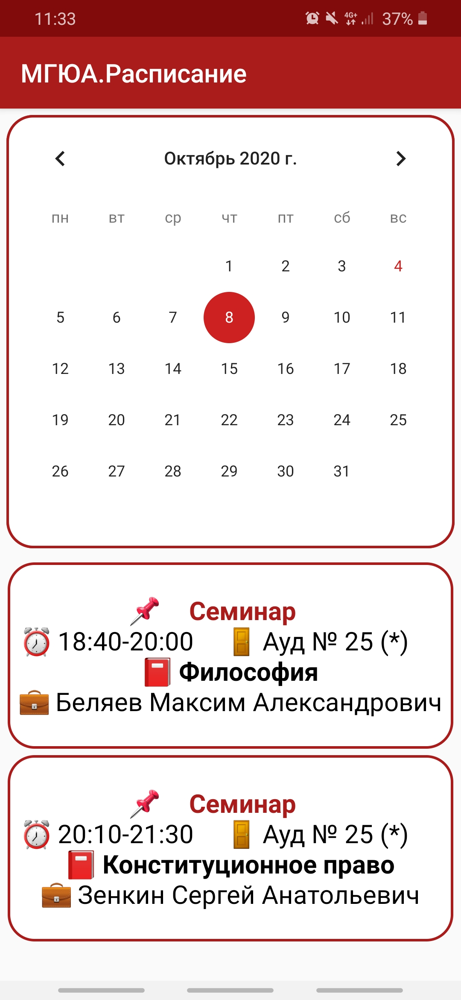
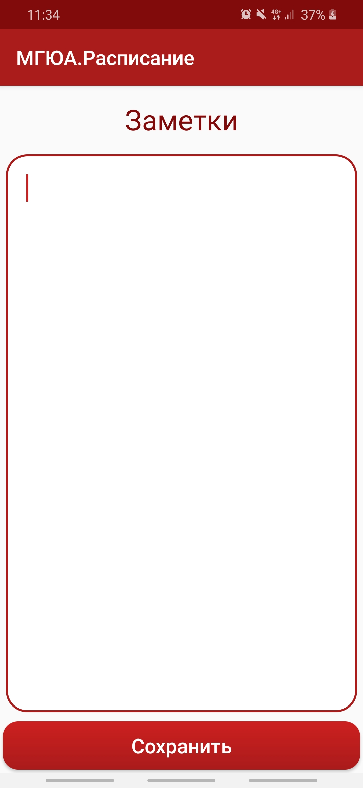

# TimetableParser 

<b>Using this app you can:</b>
<ol>
<li>Login and download actual personal schedule for any required period.</li>
<li>Locally store the downloaded schedule and view it without using internet connection.</li>
<li>Make notes to your lessons if you want to remember somthing useful, write hometask e.t.c.</li>
</ol>

